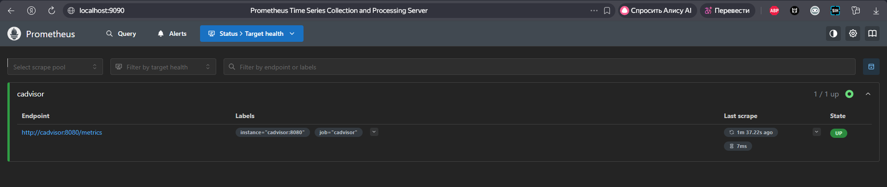
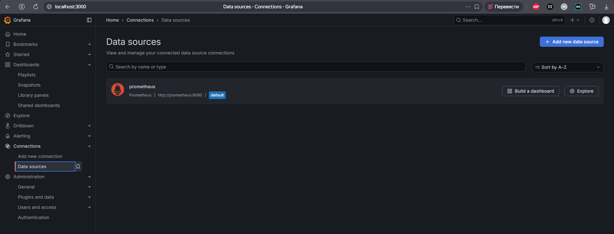

# Practice 1.2 — Monitoring Prometheus and Grafana

## 📌 Описание
Учебная практика 1.2.  
Проект демонстрирует развёртывание системы мониторинга с использованием Prometheus и Grafana.

---

## 🧩 Архитектура
Prometheus собирает метрики с Node Exporter и передаёт их в Grafana для визуализации.

---

## 📊 Основные метрики

| Метрика | Описание |
|------|---------|
| up | Доступность сервиса |
| node_cpu_seconds_total | Загрузка CPU |
| node_memory_MemAvailable_bytes | Свободная RAM |
| node_filesystem_avail_bytes | Свободное место на диске |

---

## ⚙️ Конфигурация Prometheus

```yaml
global:
  scrape_interval: 15s
```
---

## 🚀 Запуск проекта
```bash
docker-compose up -d
```

---

## 📈 Grafana

Адрес:
http://localhost:3000

---

## 🖼️ Скриншоты
Prometheus Targets


Grafana Data Source


Grafana Dashboard

